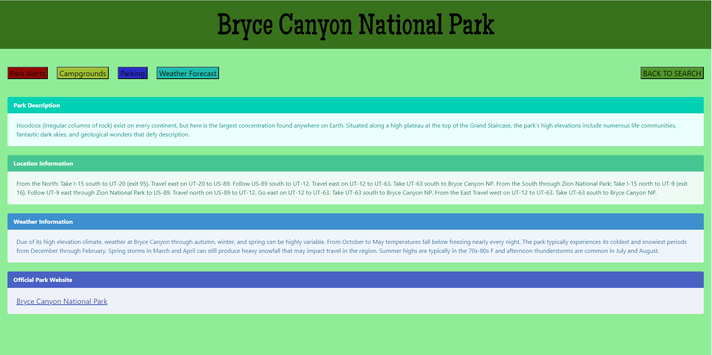

# CampingProcrastinator
Camping Trip Planner for group project 1

NPS API Keys: 
Uit6YhyGq62iQh0X7UgpMxBqF7fbThcpnnLFEfBS
d8T0DNoiiFSQE4ampgcBTk0NuekdlQMlTWSS0BJP

Weather API Keys:
83d61eed31a0a84a3b429edf288391f6

Welcome to Camping Procrastinator!

Camping Procrastinator is a camping website designed to provide outdoor enthusiasts with essential information and resources for planning their next adventure in the great outdoors. Whether you're a seasoned camper or a beginner, Camping Procrastinator has got you covered with features using Bulma, weather API, National Park Service API, and jQuery.

Features:
1. User-Friendly Interface: Camping Procrastinator is built with Bulma, a modern CSS framework based on Flexbox. The responsive design ensures that you can access the website seamlessly across different devices, whether you're using a desktop computer, tablet, or smartphone.

2. Real-Time Weather Updates: Planning a camping trip requires knowing what weather conditions to expect. With Camping Procrastinator, you can get real-time weather updates for your desired camping location using a weather API up to a week in advance. Stay informed about temperature, precipitation, wind speed, and more to make the most of your outdoor experience.

3. Explore National Parks: Camping Procrastinator integrates with the National Park Service API to provide detailed information about national parks across the United States. Discover the parking situations, campgrounds with directions to them, and important visitor information for each park. Whether you're interested in exploring iconic landmarks like Yellowstone or experiencing the serene beauty of the Great Smoky Mountains, Camping Procrastinator helps you plan your visit.

4. Easy to Follow Directions: Camping Procrastinator has implemented easy to follow direction to acces every national park in each state across the United States from various points. Following which if there is any questions about other information that Camping Procrastinator can not supply then when selecting your park for camping there is a direct link to the Official Park Website.

GitHub URL:
https://github.com/Joel-Fischer/CampingProcrastinator

Website URL:
https://joel-fischer.github.io/CampingProcrastinator/

Screenshots:

